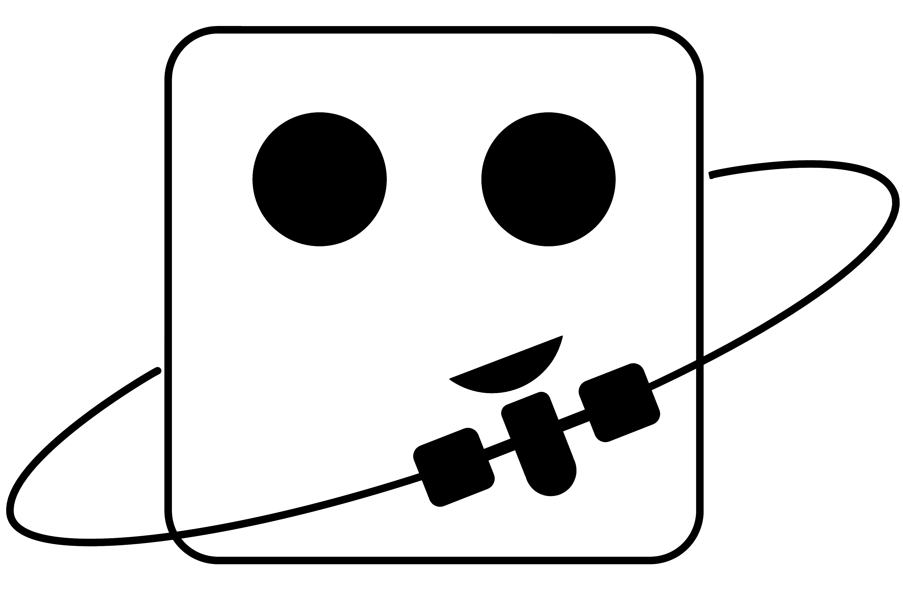

I am an Assistant Professor at Utah State University in the Mechanical and Aerospace Engineering Department and the Autonomy, Robotics, Control, and Optimization Group [ARCO](https://sites.google.com/view/usu-arco/). I run the DyCE lab studying Dynamics, Control, and Estimation in the context of cislunar astrodynamics, rendezvous and proximity operations, and space situational awareness.

My primary interest at the moment is in addressing guidance, navigation, and control challenges by analyzing higher-order tensors for partial derivatives and statistical moments.

I completed my PhD at Cornell University in the Center for Applied Mathematics in Dmitry Savransky's [SIOSlab](https://sioslab.mae.cornell.edu/). I received a B.S. in Mathematics at Texas Tech University.

I am recruiting students. Please reach out via email with a resume/CV if you are interested in working together. You can find my public calendar [here](https://outlook.office365.com/owa/calendar/7baca282cf5b46269163b1794052d82b@usu.edu/a250cbe6589f430a8b38c1bfae8a59ae3463876280939383024/calendar.html) if you would like to propose a meeting time. 

